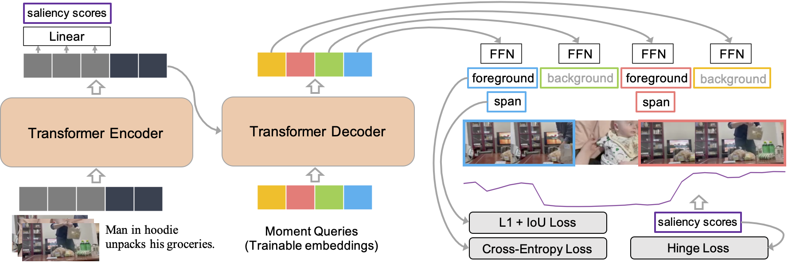

# Deteccion de momentos en video con Moment-DETR

## 1. Resumen (Abstract)

Este proyecto implementa una solucion de inferencia para **deteccion de momentos relevantes en video a partir de consultas en lenguaje natural**, usando la arquitectura **Moment-DETR**. El sistema recibe un video y una consulta textual en ingles, procesa ambos elementos con representaciones multimodales basadas en CLIP, carga un checkpoint entrenado de Moment-DETR y devuelve el intervalo temporal donde es mas probable que ocurra la accion descrita.

El trabajo se desarrollo sobre el modelo propuesto en el articulo **"QVHighlights: Detecting Moments and Highlights in Videos via Natural Language Queries"**. En terminos funcionales, el proyecto permite ejecutar una demo local con Streamlit, subir videos propios, escribir una consulta y visualizar el fragmento detectado por el modelo. Ademas, conserva los scripts originales para entrenamiento, inferencia sobre QVHighlights y evaluacion con metricas de Moment Retrieval y Highlight Detection.

En las pruebas realizadas con el video `repolarizador.mp4` y la consulta **"Showing beauty products"**, el sistema detecto el intervalo aproximado **0.04 s - 30.04 s** con una confianza de **0.9826**. Este resultado es coherente con el contenido observado, ya que el producto aparece durante practicamente todo el video. A nivel de validacion del checkpoint incluido, el modelo reporta **MR-full-mAP = 30.58**, **MR-full-R1@0.5 = 53.23** y **HL-min-Fair-mAP = 68.29**, lo que muestra un comportamiento razonable para recuperacion de momentos y deteccion de clips salientes, especialmente en ventanas temporales medias y largas.

## 2. Introduccion

### Articulo base y repositorio original

El articulo base del proyecto es:

**QVHighlights: Detecting Moments and Highlights in Videos via Natural Language Queries**, propuesto por Jie Lei, Tamara L. Berg y Mohit Bansal en NeurIPS 2021.

- Articulo: [https://arxiv.org/abs/2107.09609](https://arxiv.org/abs/2107.09609)
- Repositorio original: [https://github.com/jayleicn/moment_detr](https://github.com/jayleicn/moment_detr)

### Contexto del problema

La busqueda dentro de videos es un problema relevante en vision por computador y procesamiento de lenguaje natural. En muchos escenarios no basta con clasificar un video completo; se necesita encontrar **en que segundo exacto ocurre una accion, evento u objeto descrito por texto**. Por ejemplo, ante una consulta como "spraying perfume", el sistema debe localizar el fragmento donde se rocia el perfume y no solamente determinar que el video completo pertenece a la categoria "perfume".

Esta tarea se conoce como **Video Moment Retrieval** o recuperacion de momentos en video. Cuando ademas se asigna un puntaje de relevancia a clips del video, se habla de **Highlight Detection**. QVHighlights combina ambas tareas: localizar ventanas temporales relevantes y estimar que clips son mas destacados para una consulta.

### Motivacion

La motivacion principal del proyecto es aplicar un modelo de investigacion moderno a una demo funcional. En lugar de revisar manualmente un video para encontrar un momento especifico, el usuario puede cargar el archivo, escribir una consulta y obtener automaticamente el intervalo mas relevante. Esto puede ser util en:

- Analisis de videos promocionales o de productos.
- Busqueda de acciones especificas dentro de grabaciones largas.
- Segmentacion automatica de clips.
- Sistemas de recuperacion multimedia.
- Apoyo a herramientas de edicion de video.

### Objetivo

El objetivo general es implementar y documentar una tuberia de inferencia basada en Moment-DETR que permita detectar momentos relevantes en videos propios usando lenguaje natural.

Objetivos especificos:

- Comprender la arquitectura Moment-DETR y su relacion con Transformers y DETR.
- Preparar una interfaz sencilla para cargar videos y consultas.
- Cargar pesos preentrenados del modelo desde un checkpoint local.
- Preprocesar video y texto con CLIP y FFmpeg.
- Ejecutar inferencia y mostrar el intervalo detectado.
- Analizar metricas del checkpoint y resultados de pruebas propias.

## 3. Marco teorico

### Arquitectura Transformer

La arquitectura Transformer fue propuesta por Vaswani et al. en **"Attention Is All You Need"**. Su idea principal es reemplazar estructuras recurrentes por mecanismos de atencion que permiten modelar relaciones entre todos los elementos de una secuencia en paralelo.

El componente central es la atencion escalada de producto punto:

```text
Attention(Q, K, V) = softmax((QK^T) / sqrt(d_k))V
```

Donde:

- `Q` son las consultas o queries.
- `K` son las claves o keys.
- `V` son los valores o values.
- `d_k` es la dimension de las claves.

El mecanismo compara cada elemento de la secuencia con los demas, calcula pesos de relevancia y combina la informacion de acuerdo con esos pesos. En **multi-head attention**, esta operacion se realiza varias veces en paralelo para capturar relaciones distintas entre tokens, clips o regiones.

### Encoder-decoder Transformer

Moment-DETR utiliza una arquitectura Transformer de tipo encoder-decoder:

- El **encoder** recibe una secuencia multimodal formada por tokens de video y tokens de texto. Su trabajo es generar una memoria contextual donde cada elemento puede atender a los demas.
- El **decoder** recibe un conjunto de consultas aprendibles, llamadas en este proyecto **moment queries**, y las usa para extraer de la memoria del encoder posibles ventanas temporales relevantes.

En este repositorio, el Transformer se define en `moment_detr/transformer.py` y se configura con los parametros principales guardados en `run_on_video/moment_detr_ckpt/opt.json`:

```text
hidden_dim       = 256
enc_layers       = 2
dec_layers       = 2
nheads           = 8
dim_feedforward  = 1024
dropout          = 0.1
num_queries      = 10
```

### De DETR a Moment-DETR

DETR, propuesto por Carion et al., plantea la deteccion de objetos como un problema de prediccion directa de conjuntos. En lugar de usar muchas propuestas y reglas manuales, DETR produce un numero fijo de predicciones y las empareja con las etiquetas reales mediante **asignacion bipartita hungara**.

Moment-DETR adapta esta idea al dominio temporal:

- En DETR se predicen cajas 2D de objetos.
- En Moment-DETR se predicen ventanas temporales `[inicio, fin]`.
- En DETR las queries representan posibles objetos.
- En Moment-DETR las queries representan posibles momentos relevantes.

La ventaja es que el modelo aprende a generar directamente las ventanas temporales candidatas sin depender de un generador externo de propuestas.

### Fusion multimodal de video y texto

Moment-DETR recibe dos modalidades:

- **Video**: una secuencia de embeddings visuales por clip.
- **Texto**: una secuencia de embeddings de la consulta.

Ambas se proyectan a la misma dimension (`hidden_dim=256`) y luego se concatenan:

```text
src = [tokens_video ; tokens_texto]
```

El encoder Transformer procesa esta secuencia completa. Asi, los clips del video pueden atender a las palabras de la consulta y viceversa. Esta fusion permite que la localizacion temporal este condicionada por el lenguaje.

### Codificacion temporal

Como el Transformer no tiene una nocion interna del orden temporal, el modelo agrega codificacion posicional. Para los clips de video se usa una codificacion sinusoidal 1D en `moment_detr/position_encoding.py`.

Ademas, el proyecto usa **Temporal Endpoint Features (TEF)** cuando `ctx_mode=video_tef`. Estas caracteristicas agregan dos valores por clip:

```text
[inicio_normalizado, fin_normalizado]
```

Esto ayuda al modelo a conocer la posicion relativa de cada clip dentro del video.

### Cabezas de prediccion

El modelo produce tres salidas principales desde `moment_detr/model.py`:

| Salida | Forma conceptual | Funcion |
| --- | --- | --- |
| `pred_logits` | `[batch, num_queries, 2]` | Clasifica cada query como momento relevante o fondo. |
| `pred_spans` | `[batch, num_queries, 2]` | Predice el centro y ancho de cada ventana temporal. |
| `saliency_scores` | `[batch, L_vid]` | Asigna un puntaje de saliencia a cada clip del video. |

Con `span_loss_type="l1"`, cada span se representa como:

```text
[centro, ancho]
```

Durante inferencia se convierte a:

```text
[inicio, fin]
```

mediante la funcion `span_cxw_to_xx()` definida en `moment_detr/span_utils.py`.

### Funcion de perdida e innovaciones

Moment-DETR entrena con una combinacion de perdidas:

- **Perdida de clasificacion (`loss_label`)**: separa queries foreground y background.
- **Perdida L1 de span (`loss_span`)**: penaliza diferencias entre ventanas predichas y reales.
- **GIoU temporal (`loss_giou`)**: mide la calidad de solapamiento temporal.
- **Perdida de saliencia (`loss_saliency`)**: fuerza que clips positivos tengan mayor puntaje que clips negativos.
- **Perdidas auxiliares (`aux_loss`)**: aplicadas en capas intermedias del decoder para estabilizar el entrenamiento.

El emparejamiento entre predicciones y ground truth se realiza con `HungarianMatcher` en `moment_detr/matcher.py`. Los costos por defecto son:

```text
set_cost_span  = 10
set_cost_giou  = 1
set_cost_class = 4
```

La innovacion principal del enfoque es unir:

- Transformers multimodales.
- Prediccion directa de conjuntos estilo DETR.
- Localizacion temporal de momentos.
- Deteccion de highlights por clip.
- Uso de lenguaje natural como condicion de busqueda.

### Arquitectura

La siguiente imagen resume la arquitectura de Moment-DETR utilizada como base del proyecto:



La imagen se interpreta de izquierda a derecha. En la parte inferior izquierda aparecen las entradas del modelo: un video representado como una secuencia de clips y una consulta textual, por ejemplo `"Man in hoodie unpacks his groceries."`. Antes de entrar al Transformer, ambos elementos se convierten en embeddings numericos. En este proyecto, para la demo de inferencia, esos embeddings se obtienen con CLIP: los frames del video se codifican con el encoder visual y la consulta con el encoder textual.

El primer bloque grande es el **Transformer Encoder**. Este bloque recibe la secuencia multimodal formada por tokens de video y texto. Su funcion es contextualizar la informacion: cada clip puede atender a otros clips y tambien a los tokens de la consulta. Por eso, despues del encoder, las representaciones de video ya no son solo visuales, sino que estan condicionadas por el lenguaje.

En la parte superior izquierda se muestra una salida auxiliar de **saliency scores**. Estos puntajes se calculan sobre la memoria del encoder correspondiente a los clips del video. Su objetivo es indicar que clips son mas relevantes o llamativos para la consulta. Durante entrenamiento, esta rama se optimiza con una perdida tipo hinge para que clips positivos tengan mayor score que clips negativos.

El segundo bloque grande es el **Transformer Decoder**. A diferencia del encoder, el decoder no recibe directamente otra frase del usuario, sino un conjunto de **Moment Queries**, que son embeddings entrenables. Cada query funciona como una ranura de deteccion: intenta encontrar un posible momento relevante dentro del video. En el checkpoint usado por este proyecto hay `num_queries = 10`, por lo tanto el modelo produce hasta 10 candidatos de ventana temporal.

En la parte derecha de la imagen aparecen las salidas de cada moment query. Cada una pasa por una red feed-forward (`FFN`) que predice dos cosas:

- Una clase: **foreground** si la query corresponde a un momento relevante, o **background** si no encontro un momento util.
- Un **span temporal**, es decir, una ventana `[inicio, fin]` del video.

Las ventanas coloreadas sobre la linea de frames representan los momentos candidatos. Las queries clasificadas como foreground se consideran predicciones relevantes, mientras que las background se descartan o reciben baja confianza. Para entrenar estas salidas, Moment-DETR usa **Cross-Entropy Loss** para clasificacion y **L1 + IoU Loss** para ajustar la ubicacion temporal de los spans.

En resumen, la arquitectura combina tres ideas clave: primero fusiona video y texto con el encoder, luego usa queries aprendibles en el decoder para proponer momentos, y finalmente produce tanto ventanas temporales como scores de saliencia. Esta es la razon por la que el modelo puede responder a una consulta textual devolviendo un intervalo concreto del video.

## 4. Metodologia

### Proceso de implementacion

El proyecto parte del codigo base de Moment-DETR y lo adapta para una ejecucion local orientada a inferencia. La implementacion se organiza en dos niveles:

1. **Nucleo del modelo**: conserva la estructura original en `moment_detr/`, incluyendo configuracion, dataset, modelo, entrenamiento, inferencia y evaluacion.
2. **Demo de inferencia propia**: agrega una interfaz Streamlit en `app.py` y utiliza `run_on_video/` para ejecutar el modelo sobre videos cargados por el usuario.

Los archivos mas importantes para la inferencia son:

| Archivo | Funcion |
| --- | --- |
| `app.py` | Interfaz web local con Streamlit para cargar video, escribir consulta y visualizar resultados. |
| `run_on_video/run.py` | Define `MomentDETRPredictor` y ejecuta la localizacion del momento. |
| `run_on_video/data_utils.py` | Extrae frames con FFmpeg y genera embeddings CLIP de video y texto. |
| `run_on_video/model_utils.py` | Reconstruye la arquitectura y carga los pesos desde el checkpoint. |
| `run_on_video/moment_detr_ckpt/model_best.ckpt` | Checkpoint usado para inferencia. |
| `run_on_video/example/queries.jsonl` | Archivo temporal donde se guarda la consulta que se va a evaluar. |

### Herramientas utilizadas

| Herramienta | Uso en el proyecto |
| --- | --- |
| Python | Lenguaje principal. |
| PyTorch | Definicion del modelo, tensores e inferencia. |
| CLIP | Extraccion de embeddings visuales y textuales. |
| FFmpeg / ffprobe | Lectura, muestreo y recorte de videos. |
| Streamlit | Interfaz grafica local. |
| NumPy | Procesamiento numerico. |
| SciPy | Asignacion hungara para entrenamiento/evaluacion. |
| scikit-learn | Calculo de average precision en evaluacion. |
| JSON Lines | Formato de anotaciones y predicciones. |

### Uso de pesos preentrenados

El sistema usa dos tipos de pesos:

1. **Pesos de CLIP ViT-B/32**: se cargan para convertir frames y texto en embeddings comparables. CLIP ya fue entrenado con pares imagen-texto a gran escala.
2. **Checkpoint de Moment-DETR**: se encuentra en `run_on_video/moment_detr_ckpt/model_best.ckpt`. Este checkpoint fue entrenado con features CLIP de imagen y texto sobre QVHighlights.

Segun `run_on_video/moment_detr_ckpt/README.md`, el checkpoint incluido fue entrenado solo con features CLIP y **sin preentrenamiento ASR**, por lo que puede rendir menos que el modelo completo reportado en el articulo original.

### Datos utilizados

El repositorio incluye anotaciones de QVHighlights en `data/`:

```text
data/highlight_train_release.jsonl
data/highlight_val_release.jsonl
data/highlight_test_release.jsonl
data/highlight_test_with_gt.jsonl
data/subs_train.jsonl
```

Cada linea JSONL representa una consulta sobre un video:

```json
{
  "qid": 8737,
  "query": "A family is playing basketball together on a green court outside.",
  "duration": 126,
  "vid": "bP5KfdFJzC4_660.0_810.0",
  "relevant_windows": [[0, 16]],
  "relevant_clip_ids": [0, 1, 2, 3, 4, 5, 6, 7],
  "saliency_scores": [[4, 1, 1], [4, 1, 1], [4, 2, 1]]
}
```

Para la demo propia no se requiere preparar anotaciones completas; basta con un video y una consulta textual. El modelo devuelve una prediccion, aunque la evaluacion cuantitativa de esa prueba solo puede hacerse manualmente si no existe ground truth.

## 5. Desarrollo e implementacion

### Requisitos

Se recomienda usar un entorno virtual de Python. El codigo original fue probado con Python 3.7 y PyTorch 1.9.0; en la practica puede ejecutarse con versiones mas recientes si las dependencias son compatibles.

Dependencias principales:

```bash
pip install torch torchvision torchaudio
pip install numpy scipy pandas scikit-learn tqdm easydict tensorboard tabulate streamlit ffmpeg-python ftfy regex pillow
```

Tambien se requiere tener `ffmpeg` y `ffprobe` disponibles en el sistema:

```bash
ffmpeg -version
ffprobe -version
```

### Ejecucion de la demo

Para abrir la interfaz local:

```bash
streamlit run app.py
```

La demo realiza los siguientes pasos:

1. Permite subir un video en formato `mp4`, `mov` o `avi`.
2. Permite escribir una consulta en ingles.
3. Guarda el video en la carpeta `videos/`.
4. Escribe la consulta en `run_on_video/example/queries.jsonl`.
5. Ejecuta `python -m run_on_video.run`.
6. Muestra la salida del modelo.
7. Extrae el intervalo detectado con expresiones regulares.
8. Recorta el fragmento con FFmpeg y lo guarda en `outputs/momento_detectado.mp4`.
9. Muestra el fragmento y la confianza.

### Ejecucion por linea de comandos

Tambien se puede ejecutar directamente:

```bash
python -m run_on_video.run
```

El archivo `run_on_video/run.py` usa por defecto:

```python
video_path = "videos/repolarizador.mp4"
query_path = "run_on_video/example/queries.jsonl"
ckpt_path = "run_on_video/moment_detr_ckpt/model_best.ckpt"
device = "cpu"
```

Si se desea evaluar otro video desde linea de comandos, se debe actualizar la ruta en `run_example()` o adaptar el script para recibir argumentos.

### Carga de pesos

La carga del checkpoint ocurre en `run_on_video/model_utils.py`. El flujo es:

```python
ckpt = torch.load(ckpt_path, map_location="cpu")
args = ckpt["opt"]
transformer = build_transformer(args)
position_embedding, txt_position_embedding = build_position_encoding(args)
model = MomentDETR(...)
model.load_state_dict(ckpt["model"])
```

Primero se lee el checkpoint con `torch.load`. Luego se recupera la configuracion guardada en `ckpt["opt"]`, se reconstruye la arquitectura con los mismos hiperparametros de entrenamiento y finalmente se cargan los pesos con `load_state_dict`.

Este procedimiento es importante porque el checkpoint no solo contiene pesos: tambien contiene la configuracion necesaria para que las dimensiones del modelo coincidan, por ejemplo:

```text
t_feat_dim    = 512
v_feat_dim    = 512
hidden_dim    = 256
num_queries   = 10
max_v_l       = 75
clip_length   = 2
ctx_mode      = video_tef
```

### Preprocesamiento del video

El preprocesamiento se implementa en `run_on_video/data_utils.py`.

El video se procesa asi:

1. `ffprobe` obtiene informacion del archivo: duracion, resolucion y FPS.
2. `ffmpeg` muestrea frames con `framerate=1/2`, es decir, un frame cada 2 segundos.
3. Los frames se redimensionan y recortan al centro con tamano `224 x 224`.
4. Se normalizan con las medias y desviaciones usadas por CLIP:

```text
mean = [0.48145466, 0.4578275, 0.40821073]
std  = [0.26862954, 0.26130258, 0.27577711]
```

5. CLIP codifica cada frame con `encode_image`.
6. Los embeddings se normalizan con norma L2.
7. Se agregan las TEF: inicio y fin normalizados de cada clip.

Por la configuracion del checkpoint, el numero maximo de clips es `75`. Como cada clip representa 2 segundos, la duracion maxima soportada por esta demo es aproximadamente:

```text
75 clips * 2 segundos = 150 segundos
```

### Preprocesamiento del texto

La consulta se procesa con CLIP:

1. Se tokeniza con `clip.tokenize`.
2. Se codifica con el encoder textual de CLIP.
3. Se toma `last_hidden_state` para conservar la secuencia de tokens.
4. Se aplica padding con `pad_sequences_1d`.
5. Se normaliza con norma L2.

El modelo recibe:

```text
src_txt      = embeddings de texto
src_txt_mask = mascara de tokens validos
src_vid      = embeddings de video + TEF
src_vid_mask = mascara de clips validos
```

### Inferencia y postprocesamiento

Durante inferencia, `MomentDETRPredictor.localize_moment()` ejecuta:

```python
outputs = self.model(**model_inputs)
prob = F.softmax(outputs["pred_logits"], -1)
scores = prob[..., 0]
pred_spans = outputs["pred_spans"]
```

Luego convierte los spans de formato `[centro, ancho]` a `[inicio, fin]`:

```python
spans = span_cxw_to_xx(spans) * video_duration
```

Cada prediccion final tiene el formato:

```text
[inicio_en_segundos, fin_en_segundos, confianza]
```

Las predicciones se ordenan de mayor a menor confianza y la demo muestra la primera.

## 6. Resultados y analisis

### Capturas de pantalla de pruebas propias

Las siguientes capturas corresponden a pruebas realizadas con la interfaz Streamlit. Se encuentran en la carpeta `capturas/` del repositorio y documentan el flujo completo: pantalla inicial, carga del video, consulta, ejecucion de inferencia, resultado y fragmento detectado.

**Pantalla inicial de la demo**


**Carga del video `repolarizador.mp4` y consulta usada**


**Visualizacion del video cargado antes de ejecutar la inferencia**


**Resultado del modelo para la consulta "Showing beauty products"**


**Fragmento detectado por el modelo y confianza**


**Segunda prueba con `perfume.mp4` y consulta "spraying perfume"**


### Resultado cualitativo de la prueba principal

En la prueba con `repolarizador.mp4`, se uso la consulta:

```text
Showing beauty products
```

La salida observada fue:

```text
Momento detectado: 0.04s - 30.04s
Confianza: 0.9826
```

Analisis:

- El video dura aproximadamente 30 segundos.
- La prediccion cubre practicamente todo el video.
- La confianza es alta (`0.9826`), lo que indica que el modelo encontro una fuerte correspondencia entre la consulta y el contenido visual.
- Visualmente, el resultado es coherente porque el producto de belleza aparece desde el inicio y se mantiene como elemento principal durante el video.
- No debe interpretarse la confianza como una exactitud absoluta; es el score interno del clasificador foreground del modelo. Para medir exactitud se necesita un ground truth temporal anotado.

La segunda prueba con `perfume.mp4` y la consulta `spraying perfume` permite verificar que la interfaz tambien acepta otro video y otra descripcion textual. Si se desea analizarla cuantitativamente, se recomienda guardar el intervalo devuelto por el modelo y compararlo manualmente con el momento real donde se rocia el perfume.

### Metricas de desempeno del checkpoint

El checkpoint incluido trae metricas de validacion en:

```text
run_on_video/moment_detr_ckpt/inference_hl_val_test_code_preds_metrics.json
```

Resumen de metricas principales:

| Metrica | Valor |
| --- | ---: |
| `MR-full-R1@0.5` | 53.23 |
| `MR-full-R1@0.7` | 34.00 |
| `MR-full-mAP` | 30.58 |
| `MR-full-mAP@0.5` | 54.80 |
| `MR-full-mAP@0.75` | 29.02 |
| `MR-long-mAP` | 41.27 |
| `MR-middle-mAP` | 29.42 |
| `MR-short-mAP` | 3.11 |
| `HL-min-Fair-mAP` | 68.29 |
| `HL-min-Fair-Hit1` | 68.32 |
| `HL-min-Good-mAP` | 57.93 |
| `HL-min-Good-Hit1` | 66.26 |
| `HL-min-VeryGood-mAP` | 35.51 |
| `HL-min-VeryGood-Hit1` | 55.87 |

### Analisis de las metricas

Las metricas se dividen en dos grupos:

1. **Moment Retrieval (MR)**: evalua si las ventanas temporales predichas coinciden con las ventanas reales.
2. **Highlight Detection (HL)**: evalua si los clips con mayor saliencia predicha coinciden con clips destacados por anotadores.

En Moment Retrieval, `MR-full-R1@0.5 = 53.23` significa que, para un umbral IoU de 0.5, la mejor prediccion del modelo coincide con el ground truth en aproximadamente el 53.23% de los casos. Cuando el umbral sube a 0.7, el valor baja a 34.00, lo cual es esperable porque se exige una coincidencia temporal mas precisa.

El `MR-full-mAP = 30.58` resume el desempeno promedio sobre varios umbrales IoU. El modelo logra mejor rendimiento en momentos largos (`MR-long-mAP = 41.27`) que en momentos cortos (`MR-short-mAP = 3.11`). Esto indica una limitacion importante: los eventos breves son mas dificiles de localizar con precision, especialmente porque la demo trabaja con clips de 2 segundos y un maximo de 75 posiciones temporales.

En Highlight Detection, `HL-min-Fair-mAP = 68.29` y `HL-min-Good-mAP = 57.93` muestran que el modelo identifica razonablemente clips relevantes o destacables. La metrica baja en `HL-min-VeryGood-mAP = 35.51`, lo cual indica que distinguir clips extremadamente destacados es mas dificil que separar clips moderadamente relevantes.

### Interpretacion general

Los resultados muestran que Moment-DETR es adecuado para una demo de busqueda temporal en videos, especialmente cuando:

- La accion u objeto descrito ocupa una parte clara del video.
- El evento no es demasiado breve.
- La consulta esta en ingles.
- El contenido visual se parece al dominio aprendido por CLIP y QVHighlights.

Sin embargo, en videos donde el evento ocurre durante pocos segundos o donde la consulta es ambigua, el modelo puede devolver intervalos demasiado amplios o con limites temporales poco precisos.

## 7. Conclusiones

El proyecto permitio implementar una tuberia completa de inferencia multimodal para localizar momentos en video mediante lenguaje natural. Se comprendio como Moment-DETR adapta la filosofia de DETR al eje temporal, usando queries aprendibles, atencion Transformer y matching hungaro para predecir ventanas temporales sin un generador externo de propuestas.

Los principales aprendizajes fueron:

- Los Transformers pueden fusionar informacion visual y textual en una unica secuencia multimodal.
- CLIP facilita la extraccion de representaciones compatibles entre imagen y texto.
- La localizacion temporal requiere convertir salidas normalizadas del modelo a segundos reales del video.
- Una demo funcional necesita no solo el modelo, sino tambien preprocesamiento, carga de pesos, manejo de archivos y postprocesamiento.
- Las metricas de validacion deben analizarse por tipo de tarea y duracion de los momentos.

Limitaciones identificadas:

- El checkpoint incluido soporta videos de hasta 150 segundos en la demo actual.
- La inferencia en CPU puede ser lenta.
- La consulta funciona mejor en ingles.
- El modelo tiene bajo desempeno en momentos cortos.
- El script `run_on_video/run.py` conserva una ruta de video fija dentro de `run_example()`.
- La demo extrae el resultado leyendo texto de consola; para una version mas robusta seria mejor devolver JSON directamente.
- El checkpoint incluido usa solo CLIP y no el esquema completo con SlowFast ni preentrenamiento ASR.

Posibles mejoras:

- Parametrizar `run_on_video/run.py` con argumentos de consola para video, consulta y dispositivo.
- Permitir inferencia en GPU desde la interfaz.
- Guardar resultados en JSON para evitar depender del texto impreso.
- Agregar una visualizacion de la linea temporal con las ventanas candidatas.
- Probar modelos con SlowFast + CLIP para comparar desempeno.
- Fine-tuning con un conjunto propio de videos y consultas del dominio objetivo.
- Incorporar soporte para consultas en espanol usando traduccion o embeddings multilingues.

## 8. Referencias

[1] J. Lei, T. L. Berg, and M. Bansal, "QVHighlights: Detecting Moments and Highlights in Videos via Natural Language Queries," in *Advances in Neural Information Processing Systems*, 2021. [Online]. Available: https://arxiv.org/abs/2107.09609

[2] J. Lei, "Moment-DETR," GitHub repository, 2021. [Online]. Available: https://github.com/jayleicn/moment_detr

[3] N. Carion, F. Massa, G. Synnaeve, N. Usunier, A. Kirillov, and S. Zagoruyko, "End-to-End Object Detection with Transformers," in *European Conference on Computer Vision*, 2020. [Online]. Available: https://arxiv.org/abs/2005.12872

[4] A. Vaswani et al., "Attention Is All You Need," in *Advances in Neural Information Processing Systems*, 2017. [Online]. Available: https://arxiv.org/abs/1706.03762

[5] A. Radford et al., "Learning Transferable Visual Models From Natural Language Supervision," in *International Conference on Machine Learning*, 2021. [Online]. Available: https://arxiv.org/abs/2103.00020

[6] OpenAI, "CLIP: Connecting Text and Images," 2021. [Online]. Available: https://openai.com/research/clip

[7] OpenAI, "CLIP," GitHub repository, 2021. [Online]. Available: https://github.com/openai/CLIP

[8] C. Feichtenhofer, H. Fan, J. Malik, and K. He, "SlowFast Networks for Video Recognition," in *IEEE/CVF International Conference on Computer Vision*, 2019. [Online]. Available: https://arxiv.org/abs/1812.03982

[9] L. Li, "HERO Video Feature Extractor," GitHub repository. [Online]. Available: https://github.com/linjieli222/HERO_Video_Feature_Extractor

[10] FFmpeg Developers, "FFmpeg Documentation." [Online]. Available: https://ffmpeg.org/documentation.html

[11] Streamlit Inc., "Streamlit Documentation." [Online]. Available: https://docs.streamlit.io/

[12] P. Virtanen et al., "SciPy 1.0: Fundamental Algorithms for Scientific Computing in Python," *Nature Methods*, vol. 17, pp. 261-272, 2020. [Online]. Available: https://doi.org/10.1038/s41592-019-0686-2
